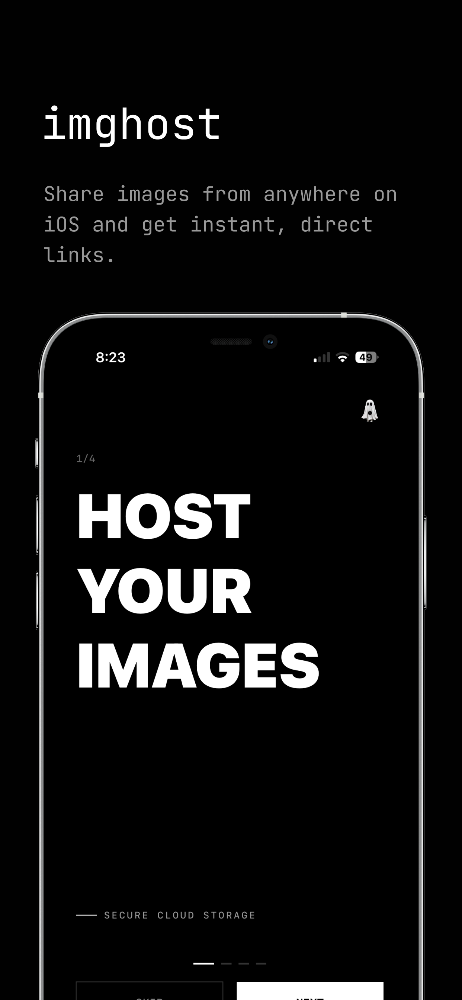
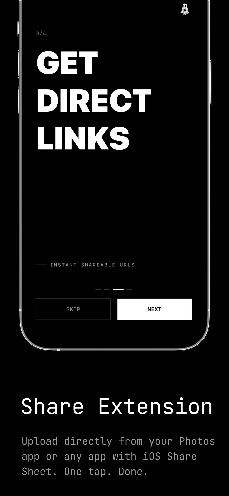
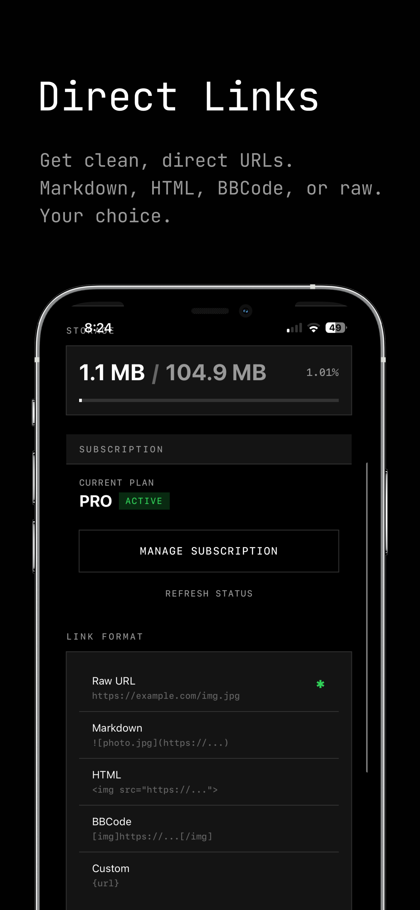
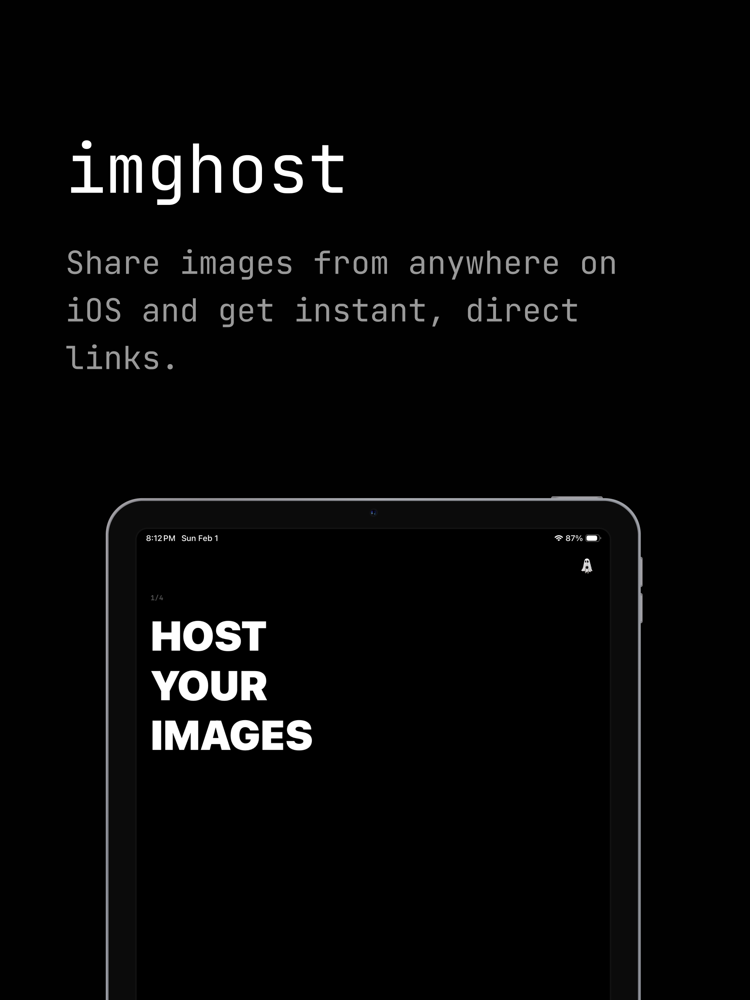
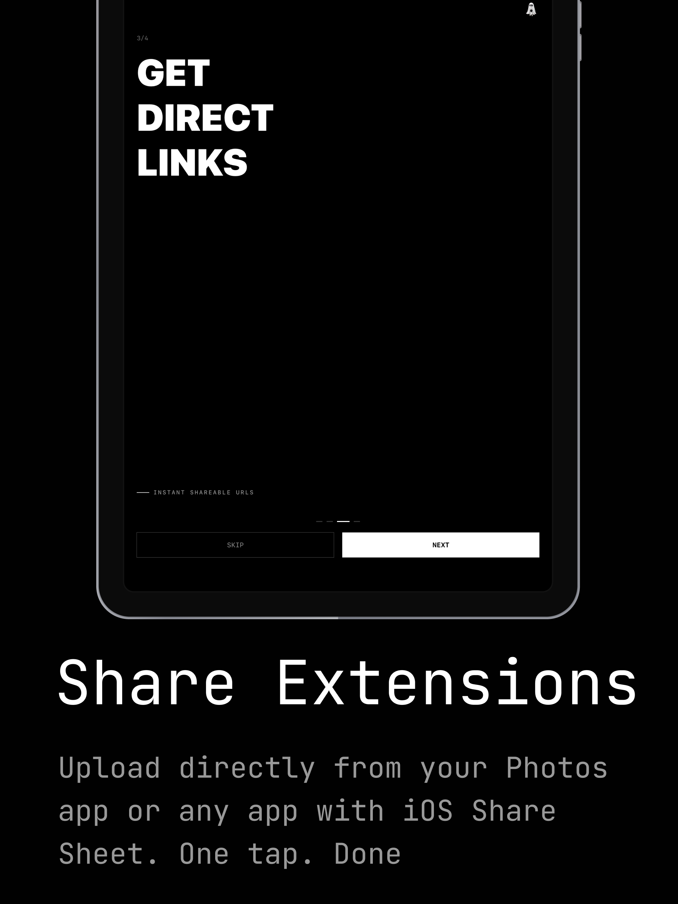
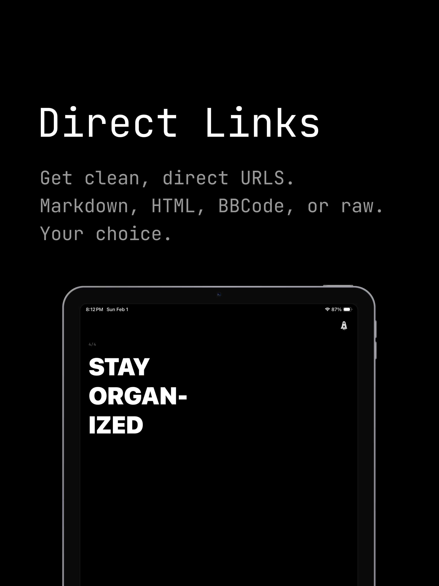

# imghost

> **Open source image hosting for iOS and macOS — upload from anywhere, get direct links instantly.**

[](LICENSE)
[](#tech-stack)
[](#tech-stack)
[](#tech-stack)

imghost is a fast image hosting and file sharing app for iOS, iPadOS, and macOS. It pairs native apps and Share Extensions with a self-hostable Cloudflare backend so you can upload photos, screenshots, videos, PDFs, and other files, then copy a clean CDN-backed link in seconds. Use the hosted service at **imghost.isolated.tech** or run your own Worker, R2 bucket, and D1 database.

**[🌐 imghost.isolated.tech](https://imghost.isolated.tech)** · **[📲 Download on the App Store](https://apps.apple.com/us/app/imghost/id6758588596)** · **[🛠 Contribute](#contributing)** · **[👥 Discord](https://discord.gg/jNRWSSSz4N)** · **[⭐ Star this repo](https://github.com/CodyBontecou/ios-share)**

## Screenshots

### iPhone

| Host your images | Share from anywhere | Get direct links |
|---|---|---|
|  |  |  |

### iPad

| Host your images | Share from anywhere | Get direct links |
|---|---|---|
|  |  |  |

## Features

### Share Extension
Upload directly from Photos, Safari, Files, Messages, or any app that supports the system share sheet. imghost uploads the selected media and copies the resulting link to your clipboard.

### macOS Drag & Drop
The macOS app supports drag-and-drop uploads, a native share extension, and a menu bar flow for quickly turning local files into shareable links.

### Direct Links
Every upload returns a direct URL with no interstitial landing page. Links are ready for chat, forums, documentation, notes, email, or social posts.

### Link Formats
Copy links as raw URLs, Markdown, Obsidian-friendly Markdown/video embeds, HTML, BBCode, or a custom template. Optional default media widths can be injected into supported formats.

### Flexible Uploads
Upload images, screenshots, videos, audio, PDFs, archives, text files, and common binary files. Quality presets can keep originals untouched or compress images and videos before upload.

### History & Library
Browse your upload history, see thumbnails and metadata, copy links again later, delete uploads, and keep iOS, iPadOS, and macOS clients in sync through the backend.

### Bulk Export
Create a ZIP archive of your uploaded media with a manifest, poll export status, and download the archive when the background job completes.

### Self-Hostable Backend
The backend is a Cloudflare Worker backed by R2 object storage and D1 metadata. It includes multi-user auth, JWT refresh tokens, Sign in with Apple, API keys, storage quotas, subscriptions, analytics, rate limiting, content moderation hooks, abuse reports, and DMCA takedown support.

## Pricing

The code is open source and free to self-host under the AGPL.

The hosted imghost service includes a free tier for lightweight hosting and a Pro subscription for higher limits and all managed-service features. Current App Store products are:

| Plan | Price | Includes |
|------|-------|----------|
| Pro Monthly | $2.99/month after a 7-day trial | 10 GB storage, 500 MB uploads, exports, API access, and all native app features |
| Pro Annual | $24.99/year after a 7-day trial | Same Pro features with annual savings |

Self-hosted deployments can change tiers, quotas, and billing logic in the Worker migrations and subscription handlers.

## Tech Stack

- **Language:** Swift 5, TypeScript
- **UI:** SwiftUI, AppKit/UIKit share extensions
- **Backend:** Cloudflare Workers, R2, D1, Workers cron triggers
- **Auth:** Email/password, JWT access + refresh tokens, API keys, Sign in with Apple
- **Payments:** StoreKit 2 subscriptions with server-side receipt/status checks
- **Media:** PhotosUI, UniformTypeIdentifiers, AVFoundation image/video compression
- **Storage:** Cloudflare R2 for objects, Cloudflare D1 for users/images/subscriptions/analytics
- **Testing:** Vitest for Worker tests
- **Minimum iOS:** 17.0+
- **Minimum macOS:** 14.0+

### Frameworks and Services Used

| Framework / Service | Purpose |
|---------------------|---------|
| SwiftUI | Native iOS, iPadOS, and macOS interfaces |
| Share Extensions | Upload from the system share sheet on iOS and macOS |
| PhotosUI / UniformTypeIdentifiers | Media picking and file type handling |
| AVFoundation | Video metadata and compression workflows |
| StoreKit 2 | Subscription purchase and restore flow |
| Security / Keychain | Shared token storage across apps and extensions |
| AuthenticationServices | Sign in with Apple |
| Cloudflare Workers | Edge API runtime |
| Cloudflare R2 | Object storage for uploaded media |
| Cloudflare D1 | Relational metadata, quotas, auth, and analytics |
| Vitest | Backend unit and integration tests |

## Project Structure

```
backend/img-host/
  src/
    index.ts                    # Worker entrypoint and routes
    auth-handlers.ts            # Email/password, Apple, anonymous auth flows
    database.ts                 # D1 data access helpers
    export.ts                   # Asynchronous bulk export jobs
    image-optimization.ts       # Transform query parsing and CF image options
    subscription-handlers.ts    # StoreKit subscription verification/status
    content-moderation.ts       # Abuse, DMCA, hash blocklist, moderation hooks
  migrations/                   # D1 schema and tier migrations
  tests/                        # Vitest backend tests
  wrangler.toml                 # Cloudflare Worker/R2/D1 configuration

frontend/imghost/
  imghost/                      # iOS/iPadOS SwiftUI app
  imghostMac/                   # macOS SwiftUI app and menu bar UI
  ShareExtension/               # iOS share extension
  MacShareExtension/            # macOS share extension
  Shared/                       # Shared models, services, config, keychain, StoreKit
  Config/                       # Debug/Release backend URL xcconfig files
  Products.storekit             # Local StoreKit subscription configuration

landing/
  index.html                    # Static marketing page served by the Worker/R2

screenshots/app-store/          # README and App Store screenshots
```

## Build Targets

| Target | Bundle ID | Platform |
|--------|-----------|----------|
| imghost | `com.codybontecou.imghost` | iOS / iPadOS |
| ShareExtension | `com.codybontecou.imghost.ShareExtension` | iOS / iPadOS share extension |
| imghostMac | `com.codybontecou.imghost` | macOS |
| MacShareExtension | `com.codybontecou.imghost.MacShareExtension` | macOS share extension |

## Setup

### Backend

1. Install dependencies:
   ```bash
   cd backend/img-host
   npm install
   ```
2. Copy local environment variables and generate a JWT secret:
   ```bash
   cp .dev.vars.example .dev.vars
   openssl rand -base64 32
   ```
3. Create Cloudflare resources and update `wrangler.toml` with your IDs:
   ```bash
   npx wrangler r2 bucket create images
   npx wrangler d1 create imghost
   ```
4. Run D1 migrations in order for local development:
   ```bash
   for file in migrations/*.sql; do
     npx wrangler d1 execute imghost --local --file="$file"
   done
   ```
5. Start the Worker locally:
   ```bash
   npm run dev
   ```

For production, set secrets with `wrangler secret put`, run the migrations against `--remote`, then deploy with `npm run deploy`.

### iOS, iPadOS, and macOS Apps

1. Open `frontend/imghost/imghost.xcodeproj` in Xcode 15+.
2. Select the **imghost** or **imghostMac** scheme.
3. Set your development team for all app and extension targets.
4. Update bundle identifiers if you are shipping your own fork.
5. Configure App Group and Keychain Sharing entitlements for every target.
6. Update `Shared/Config.swift` with your team-prefixed keychain access group.
7. Point `Config/Debug.xcconfig` and `Config/Release.xcconfig` at your backend URL if you are not using `https://imghost.isolated.tech`.
8. Build and run.

### Landing Page

The static landing page lives in `landing/index.html`. In the hosted deployment it is uploaded to R2 and served by the Worker at the root route.

```bash
wrangler r2 object put images/landing.html --file landing/index.html --remote
```

## Required Permissions and Entitlements

- **Network access** — uploads, auth, subscriptions, and history sync
- **Photo / file access** — user-selected media from Photos, Files, drag-and-drop, and share sheets
- **Sign in with Apple** — native account authentication
- **App Groups** (`group.com.imghost.shared`) — shared state between app and extensions
- **Keychain Sharing** (`$(AppIdentifierPrefix)group.com.imghost.shared`) — shared auth tokens between app and extensions
- **macOS App Sandbox** — user-selected file read/write and network client access

## Backend API

The Worker exposes a JSON + multipart API for native apps, web clients, and automation.

| Endpoint | Purpose |
|----------|---------|
| `POST /auth/register` | Create an email/password account |
| `POST /auth/login` | Log in and receive access, refresh, and API tokens |
| `POST /auth/apple` | Sign in with Apple |
| `POST /auth/refresh` | Rotate refresh token and receive a new access token |
| `GET /user` | Read account, subscription, and storage usage |
| `POST /upload` | Upload a file as multipart form data (`image=<file>`) |
| `GET /images` | List authenticated user's uploads |
| `GET /<id>.<ext>` | Serve an uploaded file directly |
| `DELETE /delete/<id>?token=...` | Delete an upload using its delete token |
| `POST /api/export` | Start a bulk export job |
| `GET /api/export/{job_id}/status` | Poll export status |
| `GET /api/export/{job_id}/download` | Download a completed export archive |
| `GET /health` | Health check |

See [`backend/img-host/README.md`](backend/img-host/README.md), [`AUTHENTICATION.md`](backend/img-host/AUTHENTICATION.md), [`EXPORT_API.md`](backend/img-host/EXPORT_API.md), and [`DATABASE.md`](backend/img-host/DATABASE.md) for deeper backend documentation.

## Contributing

Contributions are welcome — bug reports, feature ideas, docs, tests, and pull requests. Good areas to help include self-hosting documentation, backend test coverage, app accessibility, localization, media format support, and Cloudflare deployment hardening.

If you want to chat about the project, design decisions, or what to build next, jump into the [isolated.tech Discord](https://discord.gg/jNRWSSSz4N).

## License

imghost is licensed under the [GNU Affero General Public License v3.0](LICENSE). The AGPL ensures that modified versions of imghost — including hosted network services — must keep their corresponding source code open. That protects the core promise of the project: direct image hosting that users and self-hosters can inspect, run, and improve.
